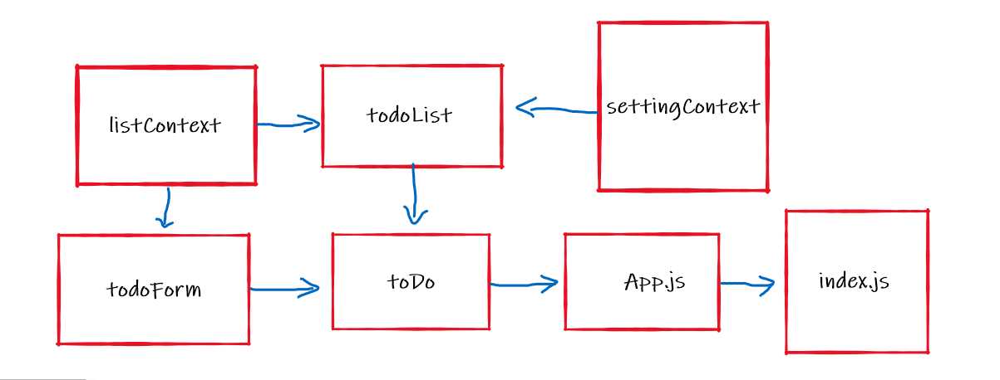

# todo-app

Incorporate configuration settings to the application.

> how a maximum of a certain number of items per screen in the List component

> Provide “next” and “previous” links to let the users navigate a long list of items

> Hide or show completed items in the list

## sandbox Link

https://codesandbox.io/s/condescending-sunset-pv758

https://codesandbox.io/s/sweet-cookies-8dn0w

https://codesandbox.io/s/eloquent-glitter-1mmif

## PR Link

https://github.com/baraahalomari/todo-app/pull/1

https://github.com/baraahalomari/todo-app/pull/3

https://github.com/baraahalomari/todo-app/pull/7

## UML

