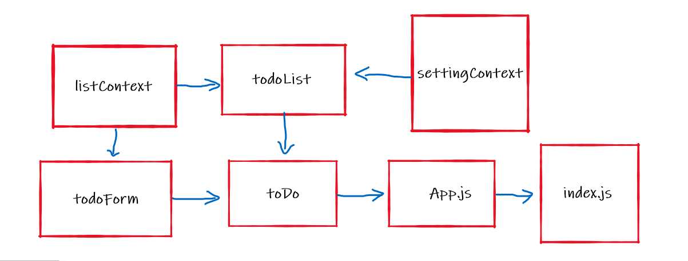

# todo-app

Incorporate configuration settings to the application.

> how a maximum of a certain number of items per screen in the List component

> Provide “next” and “previous” links to let the users navigate a long list of items

> Hide or show completed items in the list

## sandbox Link

https://codesandbox.io/s/wizardly-cdn-41chk

https://codesandbox.io/s/focused-pine-ku1nb

https://codesandbox.io/s/ancient-night-00wd2

## Netlify Link

https://goofy-hodgkin-b315fc.netlify.app/

## PR Link

https://github.com/baraahalomari/todo-app/pull/11

https://github.com/baraahalomari/todo-app/pull/20

https://github.com/baraahalomari/todo-app/pull/27

## UML

